# Display and visualization

## Interface features

After running the selected algorithm, you will notice that the program then tries to optimize the display of the group with the largest number of elements in the data set. You can change the speed at which this occurs by moving the animation speed slider.

The Display tab offers the user the ability to search for an isolate, Highlight the SLVs and DLVs, control the animation speed, select diferent diferent or multiple groups. You can fit any displayed graphs to the window by right-clicking any open space (i.e. with no link or ST node) on the window.

### Common features
   * ST search

   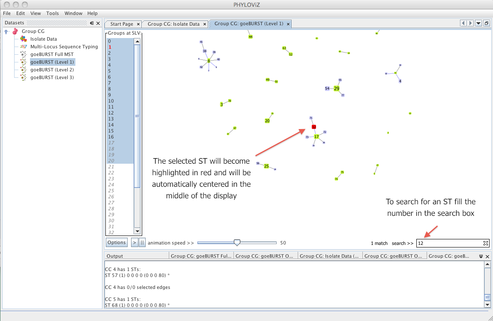
   
   * Information Area 
   
   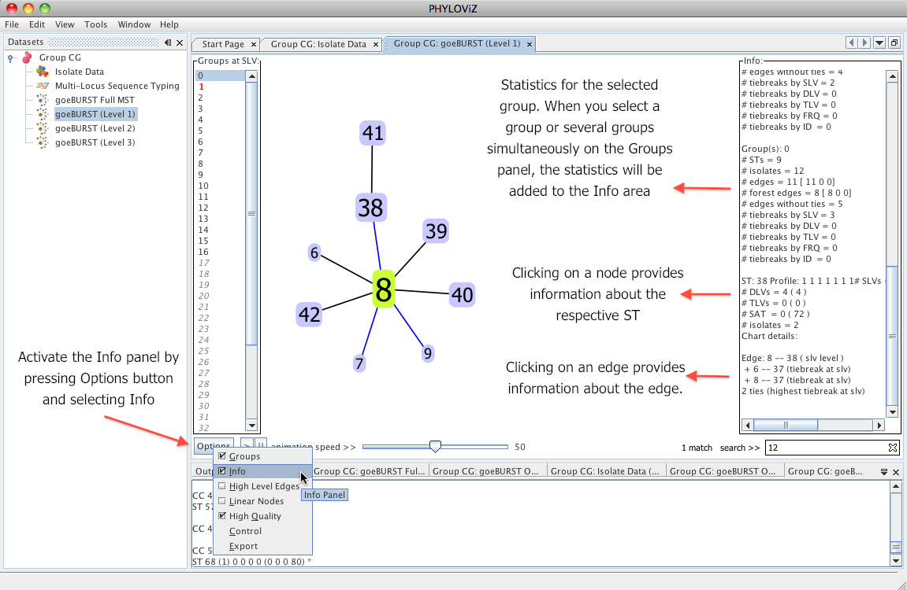
   
   * Exporting Image 
   
   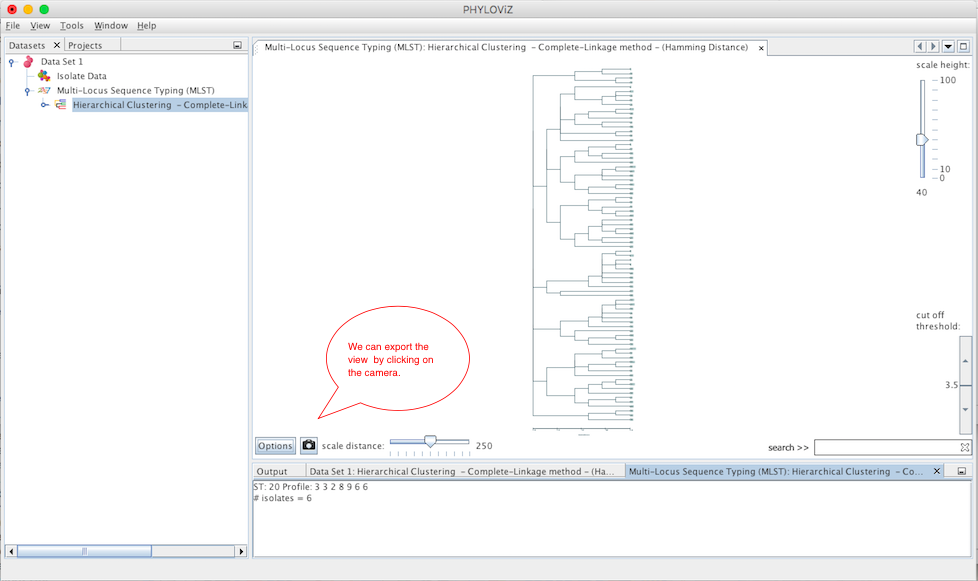
   
   * Re-scale nodes 
   
   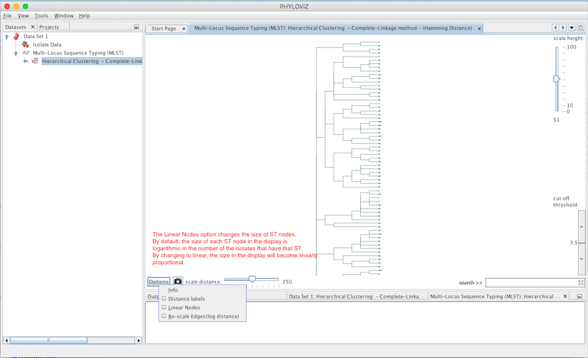
   
### GoeBURST and GoeBURST Full MST features
   * Basic Interface

   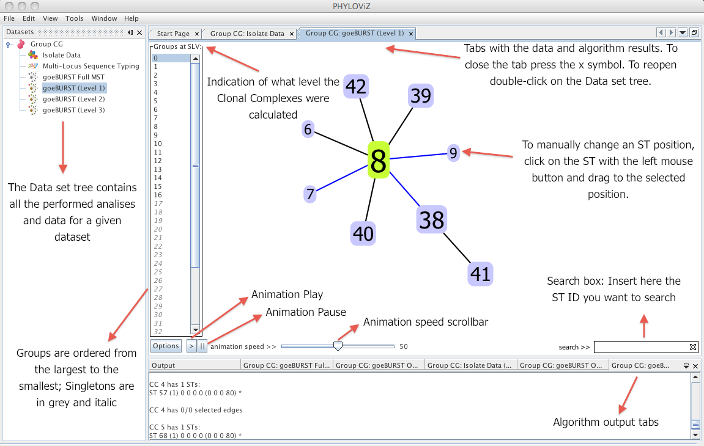

   * SLV/DLV highlighting

   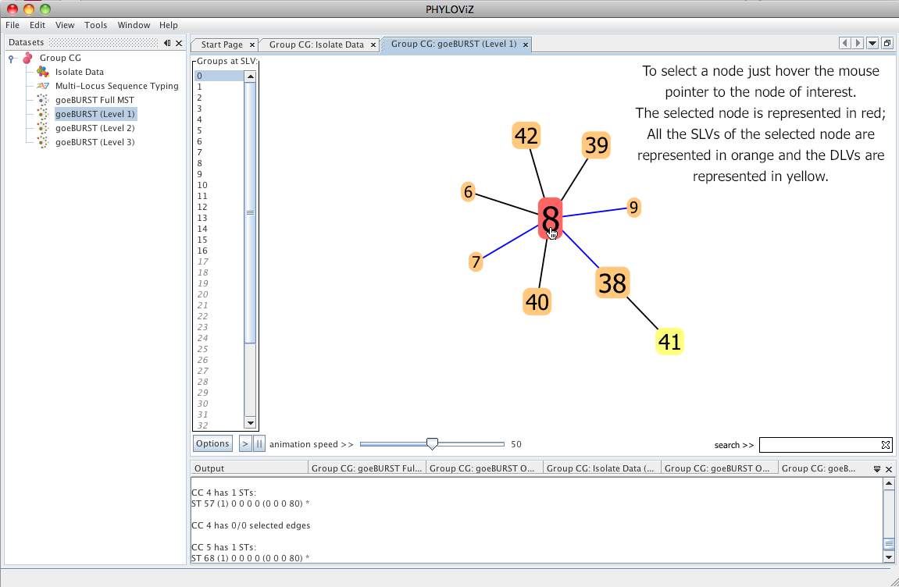

   * High Level Edges

   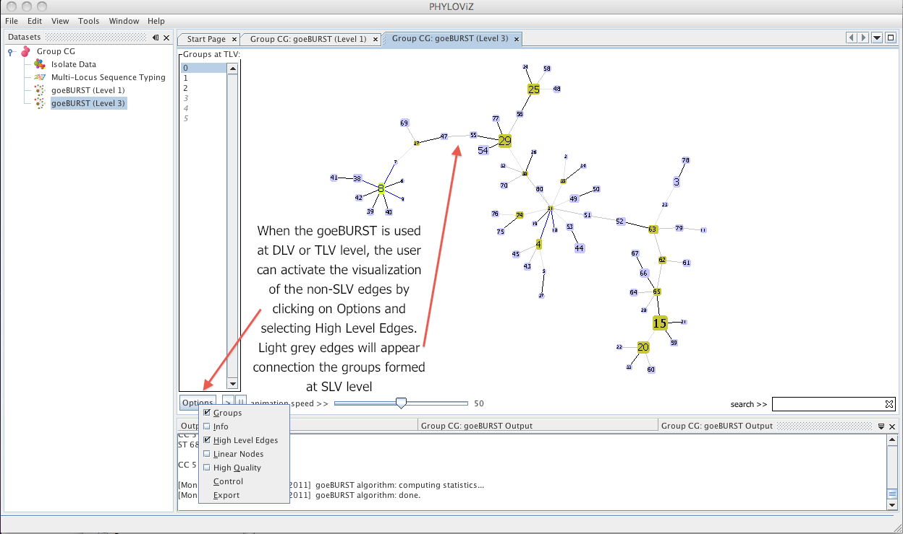

   * Saving Results 

   
   
### GoeBURS, GoeBURST Full MST and Neighbor Joinning features
   * Force Control menu 

   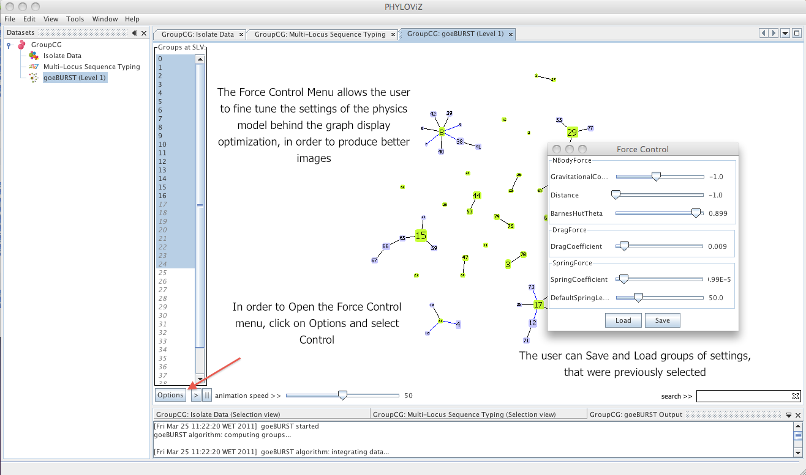
 
### Neighbor Joinning features
   * Changing the tree layout

   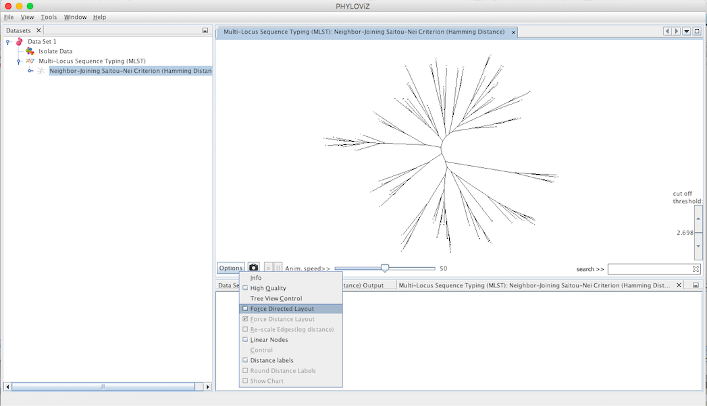
 
### Hierarchical Clustering and Neighbor Joinning features
   * Height scale 

   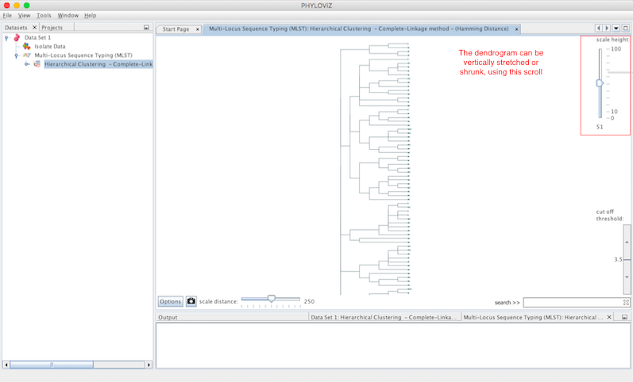

   * Width scale

   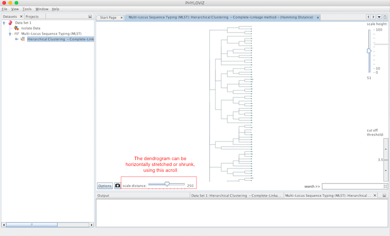

   * Filter by distance (cut off threshold) 

   

   * Re-scale edges

   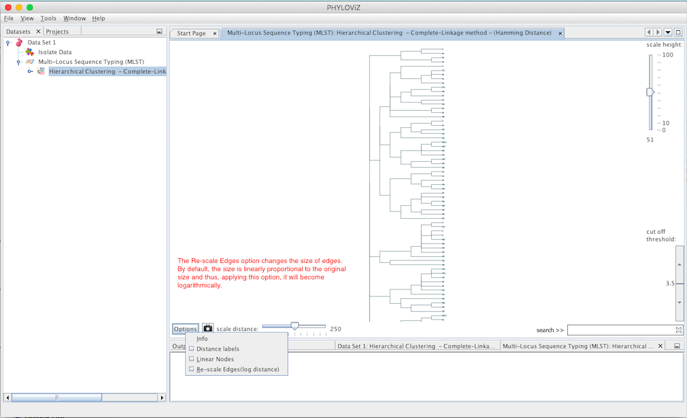
 

## Color conventions

_Link colors for goeBURST results_:
* Black - Link drawn without recourse to tiebreak rules,
* Blue - Link drawn using tiebreak rule 1 (number of SLVs),
* Green - Link drawn using tiebreak rule 2 (number of DLVs),
* Red - Link drawn using tiebreak rule 3 (number of TLVs),
* Yellow - Link drawn using tiebreak rule 4 or 5 (Frequency found on the data set and ST number , respectively),
* Gray - Links drawn at DLV (darker gray) or TLV (lighter gray) if the groups are constructed at DLV/TLV level.

_Link colors for goeBURST Full MST results_: The goeBURST Full MST algorithm links uses a grayscale with darker links having less differences between the profiles than the lighter gray links. To know the number of differences that the link represents click on the link in the Display window.

_ST nodes colors_:
* Light green - Group founder
* Dark green - Sub-group founder
* Light blue - Common node
* Red - Selected node

