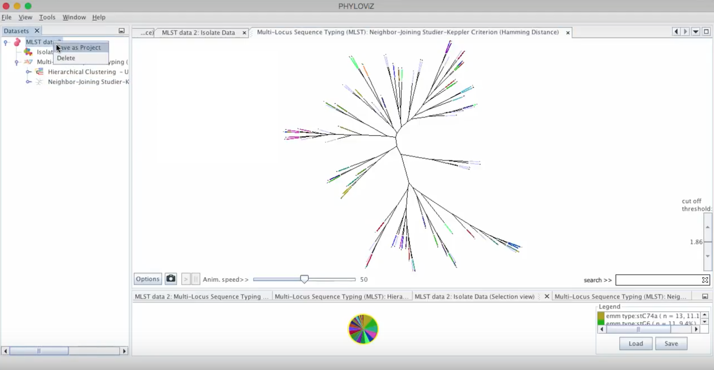
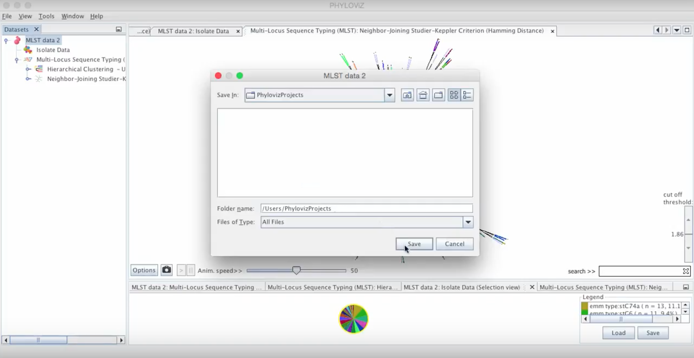
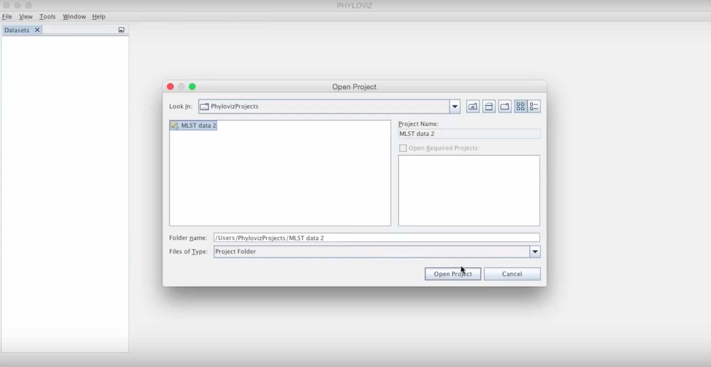
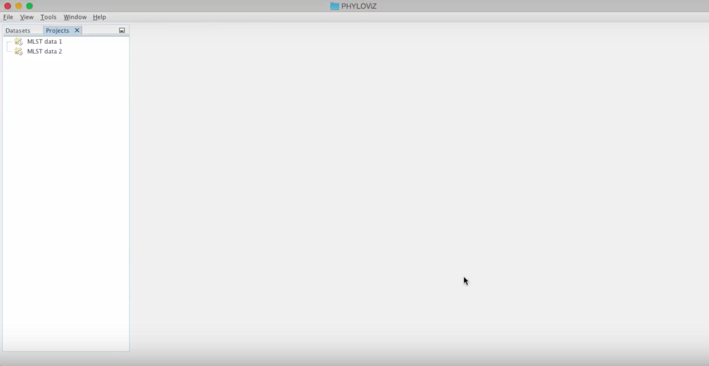
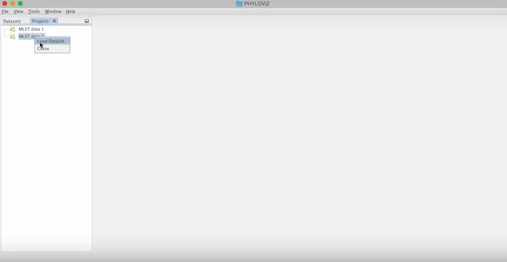
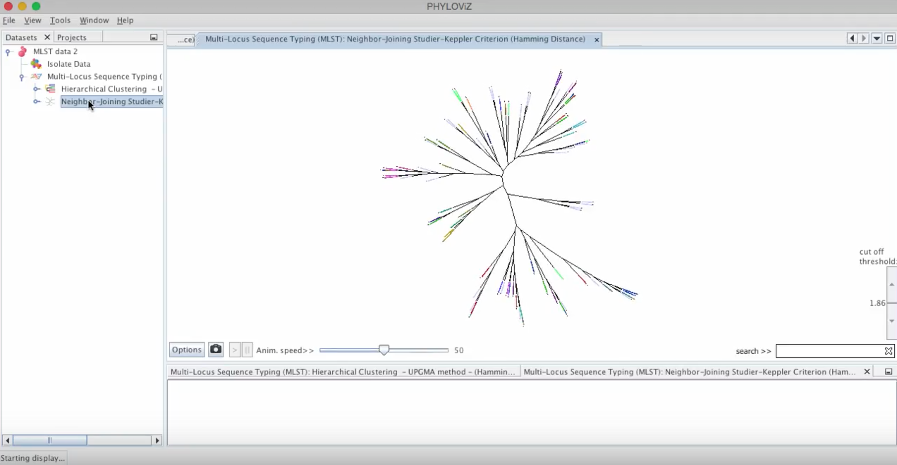

# Project management

A PHYLOViZ Project allows users to save their ongoing studies and dynamically update them. It is a time-saving feature when working with large data sets and essential for efficiently sharing results.
Each project includes the data under analysis, results of inference algorithms, visualization serializations and related customizations.

## Saving

Right click on the dataset you would like to save and choose the option _Save as Project_. As you can see we'll save a DataSet that has the isolate data integrated in the visualization.

 

Finally you can choose where to save your project.
A dialog appears if you are overriding an existing project or creating a new one with a name that was already taken in the chosen directory.

 

## Loading
Go to _File_ menu and choose _Open Project_.

 

The next step is to find the project that you would like to load.
After finding it click on _Open Project_.

 

This action will open the _Projects Tab_ where you can see your project listed and many others that were previously opened.

 

Now for restoring the study just right click on the project and select _Load DataSet_.
This will open the _Dataset's Tab_ with your saved study.

 

The project is now loaded with all the study that was done before as we can see in the following screenshot. You can check that the isolated data integrated on saving was restored completely.

