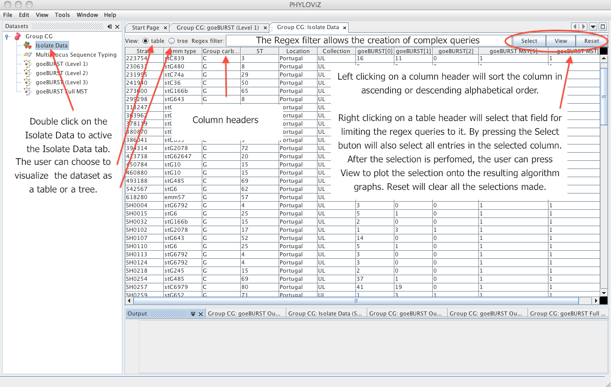
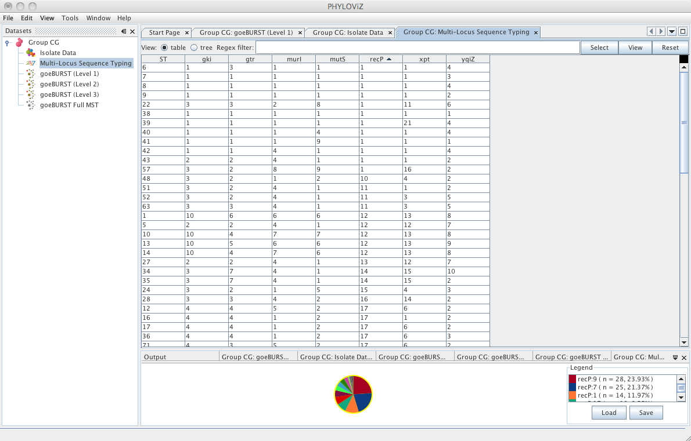
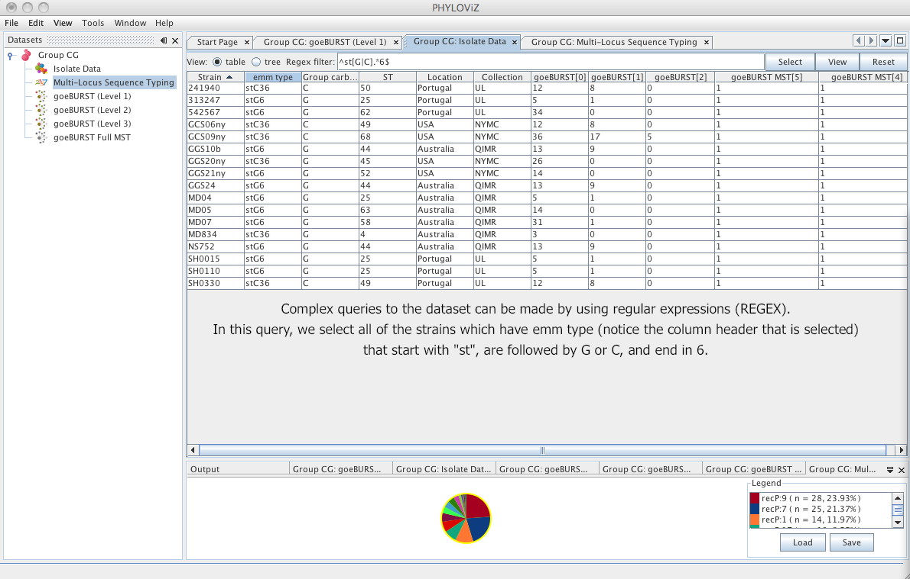
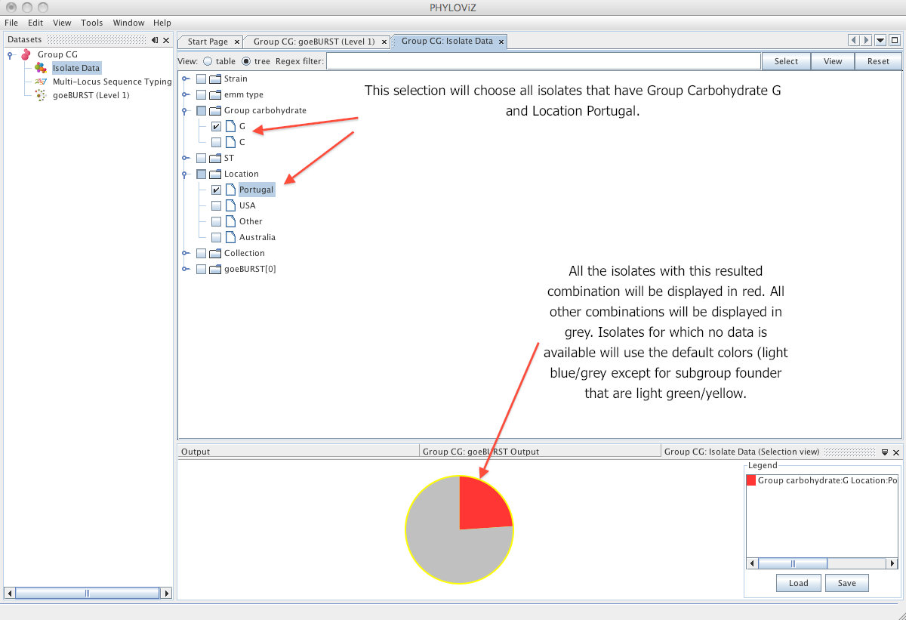
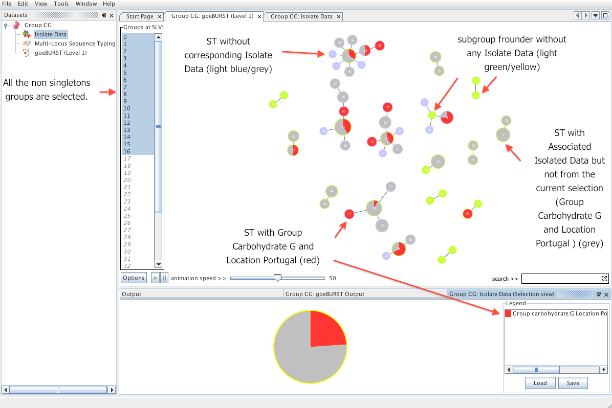
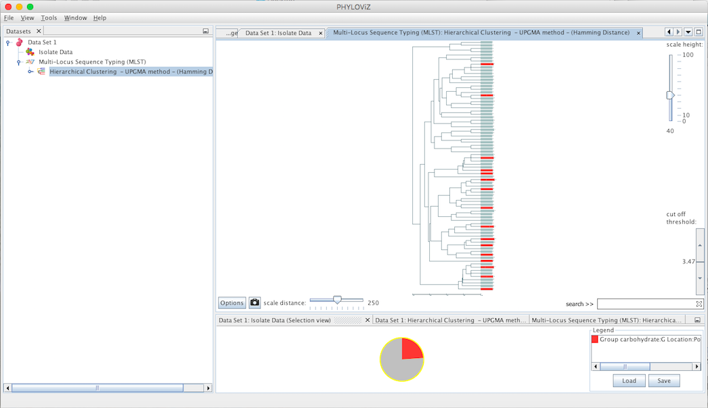
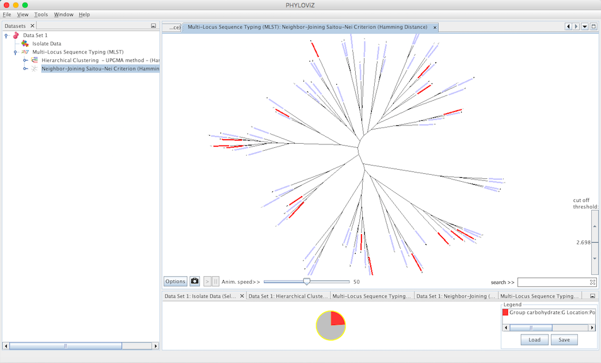
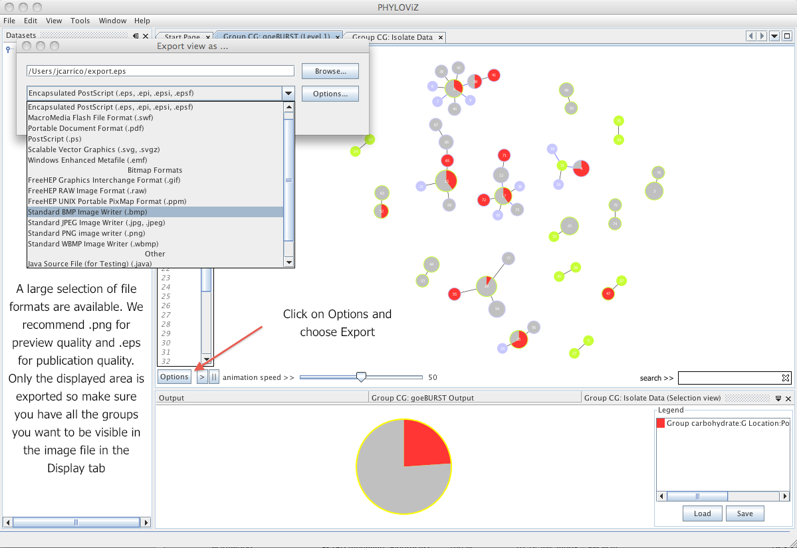

# Querying and visualizing the data

The main goal of PHYLOViZ is to provide a data visualization tool for the users overlay accessory data on the data analysis algorithms result, in order to validate it, or to allow the proposal of new hypothesis. This section will explain the basics on how this can be achieved in our software. To query the data the user has the choice of using regular expressions, or simply manually selecting the desired fields from the table or even just use the checkboxes in the tree view. Using your dataset and this instructions you should be able to create visualizations similar to the ones found in the [PHYLOViZ website](http://www.phyloviz.net/).

## The isolate data tab

The _Isolate Data_ tab is displayed by double clicking on the _Isolate Data_ on the _Dataset_ tree. The following screenshot resumes the basic functionality of the display on the table view.

## The typing data tab

The _Typing Data_ tab contains the allelic profiles loaded in the dataset. The name of displayed on the tab, and on the _Dataset_ tree, is the name of the selected method during the _Load Dataset_ procedure. The user can also query, select and visualize the data of the allelic profiles, similarly to operations describe in the Isolate Data tab. 

## Regular expression primer

Some basic regular expressions that can be used in PHYLOViZ. For more complex expressions there are extensive tutorials on regular expressions online. Just search Regular Expression or regex.

* `.` (period mark) - represents any character.
* `[ ]` (square brackets) - Match anything inside the square brackets for one character position once and only once. Examples: `[40]` will match any field with `4` or `0`; `[7-9]` will match any field will `7`, `8` or `9` ( `-` is the range separator).
* `^`(caret) - Starts with. Ex: `^P` will give you all the fields that start with a `P`. Inside the square brackets means negation. Example `[^a-c]` means anything not `a`, `b` or `c`.
* `$` (dollar sign) - Ends with. Ex. `7$` will give you all fields that end in a `7`.
* `?` (question mark) - Matches the preceding character 0 or 1 times only. Example: `colou?r` will find `color` and `colour`.
* `*` (asterisk) - Matches the preceding character 0 or more times. Example: `tre*` would find `tree`, `tread` and `trough`.
* `+` (plus) - Matches the preceding character 1 or more times. Example: `tre+` would find `tree`, `tread` but not `trough`.
* `{n}` (any integer between brackets) - Matches the preceding character exactly n times. Example: `AT[GC]{2}` would match `ATGC`, `ATCG`, `ATGG` or `ATCC` but not `ATGA`.

All these operators can be combined to create complex search expressions. For example : `^st[G|C].*6$` would find any field that starts with `st` followed by a `C` or a `G` then as 0 or more characters and ends with a `6`. The following screenshot shows the result on the test dataset:

## Queries using the table view

In the _Table_ view of the _Data_ tab you can manually select any field you want to represent by left clicking on it. That will automatically display all the entries with the selected value and not only the selected ones. To select multiple fields you can press the CTRL key (or CMD on Mac) while clicking on the desired fields. If you keep the SHIFT key pressed you can select ranges of cells.

You can also automatically select multiple columns by clicking with the right mouse button on the table headers and pressing the _Select_ button.

Finally to plot the data on the Display tab, press the View button, after all the desired selections are performed.

Click to see an example of querying:
* [_Table_ view with selections](_images/TableViewRegex.png),
* [query results Chart](_images/TableViewPie.png)
* [results on _Display_ tab](_images/TVRdisplay.png)

## Queries using the tree view

The _Tree_ view offers a faster way to create simple queries. The user can also use the regex filter to search the dataset but all the possibilities for each dataset column are automatically indexed in a tree like manner. By pressing the _Select_ button and switching to _Table_ view the user can see the resulting selection. The users can alternate both views (Table and Tree) at will for creating the selection.

**Queries on the results produced by the goeBURST and goeBURST Full MST algorithm**

**Queries on the results produced by the Hierarchical Clustering algorithm**

**Queries on the results produced by the Neighbor Joinning algorithm**

## Exporting the results to an image file

To export the resulting graphs to an image file. Click on the _Options_ button and choose _Export_. Select the adequate file format for the intended purpose. We recommend the use of png images for presentation quality and eps for publication quality.

